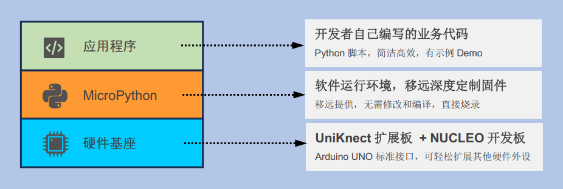
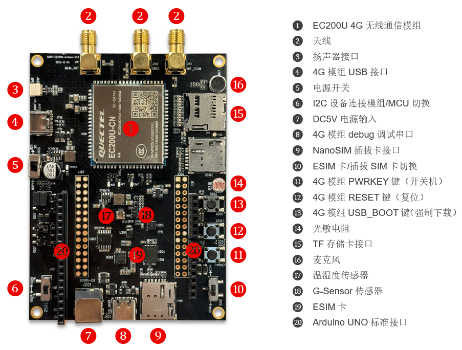
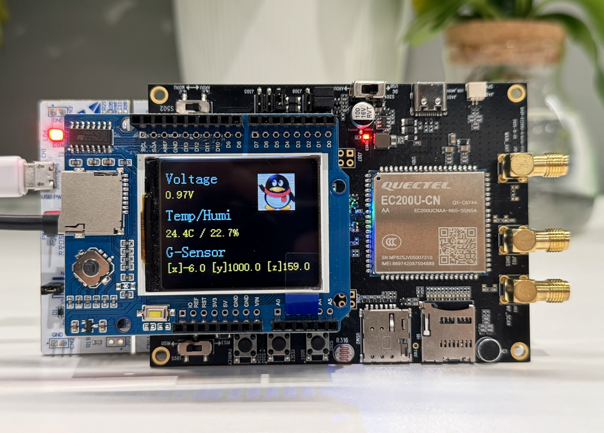
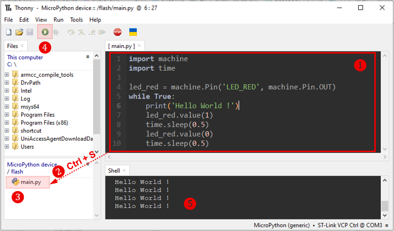

# Quectel UniKnect MicroPython
## 项目简介
Quectel UniKnect MicroPython，是一套集成了4G蜂窝网络通信能力的物联网开发套件，其中硬件结合了移远定制的 **`UniKnect Gen1-PRO`** 扩展板与主流的 **`STM32 NUCLEO-F413Z`** 开发板，软件使用简洁、易懂的 **`MicroPython`** 语言，旨在降低无线通信应用的开发门槛，让开发者能够快速、高效地构建具备广域网连接功能的智能设备原型。本项目的核心目标是，提供一个开箱即用的软硬件开发环境，使开发者无需深入底层硬件驱动与网络协议细节，专注于代码应用逻辑与创新功能的实现，例如远程数据采集、云端控制、GPS定位追踪等物联网典型场景。

## 套件构成
- **`硬件平台：`** 以STM32F413高性能MCU为核心，板载移远4G Cat.1蜂窝通信模组、光敏/温湿度/G-Sensor等传感器、以及Arduino UNO标准接口，提供稳定、易扩展的硬件基础。
  
- **`软件平台：`** 基于MicroPython深度定制与移植，提供了完整的4G网络驱动、Socket接口、TCP/UDP/HTTP/FTP/MQTT等上层协议支持，将复杂的网络编程简化为直观的Python API调用。

- **`开发体验：`** 开发者能够快速上手，通过提供预编译的固件、详细的硬件连接指南、丰富的示例脚本以及简洁的开发工具链，帮助开发者在最短时间内完成开发环境搭建并跑通第一个网络连接示例，从而将宝贵的时间投入到项目创新与优化中。

 

  

 

## 开发准备
#### 硬件相关
- UniKnect Gen1-PRO扩展板（**`OC: QADP-EC200UCNAA-Ardunio-EVB`**）
- STM32 NUCLEO-F413ZH开发板
- DC5V电源适配器，USB数据线（Type-C和Micro接口USB线各一根）
- NanoSIM卡、SMA天线
- 其他需要用到的扩展外设等
- PC

#### 软件相关
- 安装ST-Link驱动，用于固件烧录和调试
- 安装开发工具Thonny，用于开发调试
- 烧录MCU固件，用于软件运行环境

 

## UniKnect Gen1-PRO扩展板
UniKnect Gen1-PRO扩展板（**`OC: QADP-EC200UCNAA-Ardunio-EVB`**），是移远专门为物联网项目学习、开发用途定制，其主要特性如下：
- 板载EC200U 4G无线模组，最大通信速率下行10 Mbps / 上行5 Mbps
- 板载光敏、温湿度、G-Senosr传感器
- 板载ESIM卡，可切换插拔SIM卡
- 板载Arduino UNO标准接口，可与STM32 NUCLEO开发板垂直堆叠插接

 

  

 

## NUCLEO-F413ZH开发板
NUCLEO-F413ZH开发板的核心角色是运行MicroPython系统及用户程序、并通过Arduino UNO接口与UniKnect Gen1-PRO扩展板连接，从而驱动4G模组实现物联网功能。其具体描述、与UniKnect Gen1-PRO扩展板的垂直堆叠插接方法，可参考 [Quectel_UniKnect_MicroPython_快速开发指导](./docs)

  

 

 

## 软件开发环境
固件烧录和软件开发环境搭建的具体方法，可参考 [Quectel_UniKnect_MicroPython_快速开发指导](./docs)

  

 

 

## 固件下载
请在 [<u>**`Release`**</u>](https://github.com/quectel-develop/micropython/releases/latest) 页面下载最新版本固件。

## 参考文档
对于 Quick Start 的详细说明，以及其他 API参考手册，请参考 [docs](./docs/) 目录下的文档。

## 许可证
本项目遵循 Apache-2.0 许可证，详见 [LICENSE](./LICENSE)
